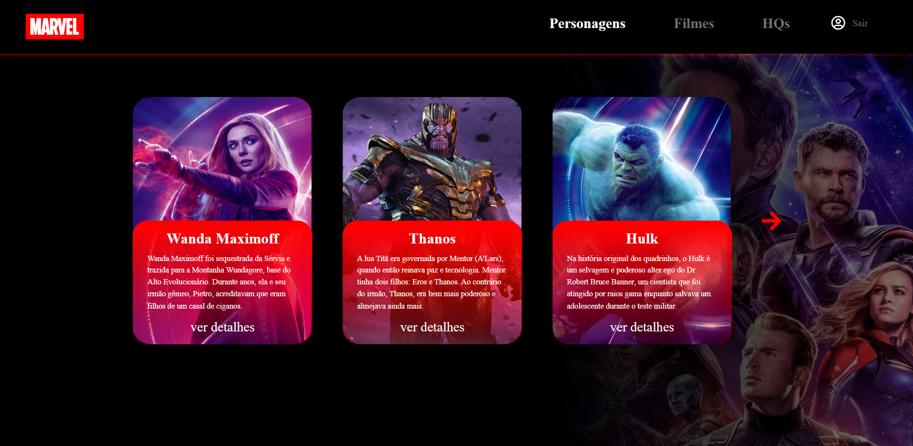

# Marvel

- [Sobre](#-sobre)
- [Tecnologias utilizadas](#-tecnologias-utilizadas)
- [Demonstração](#-demonstração)
- [Como executar](#-como-executar)

## 💻 Sobre

Este repositório abriga o projeto Marvel, composto por três telas: Personagens, Filmes e HQs. Aqui, é possível acessar informações detalhadas de cada seção ao clicar nelas, além de um carrossel que permite visualizar mais cards ao ser clicado.

## 🏗️ Tecnologias utilizadas

- Next.JS ✔
- TypeScript ✔
- Styled Components ✔

## 📷 Demonstração



## 🚀 Como executar

1. Clonar este repositório

```bash
git clone git@github.com:aureasiqueira1/marvel.git
```

2. Vá para a pasta do projeto

```bash
cd marvel
```

3. Instalar dependências

```bash
yarn install
```

3. Executar front-end

```bash
yarn dev
```
